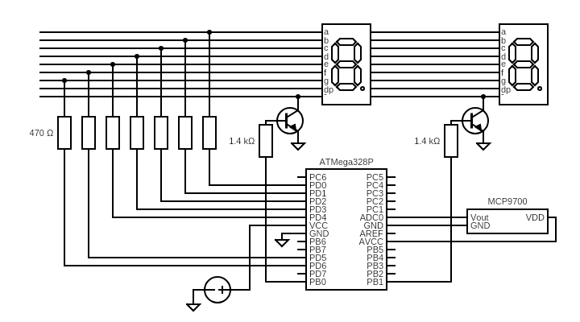
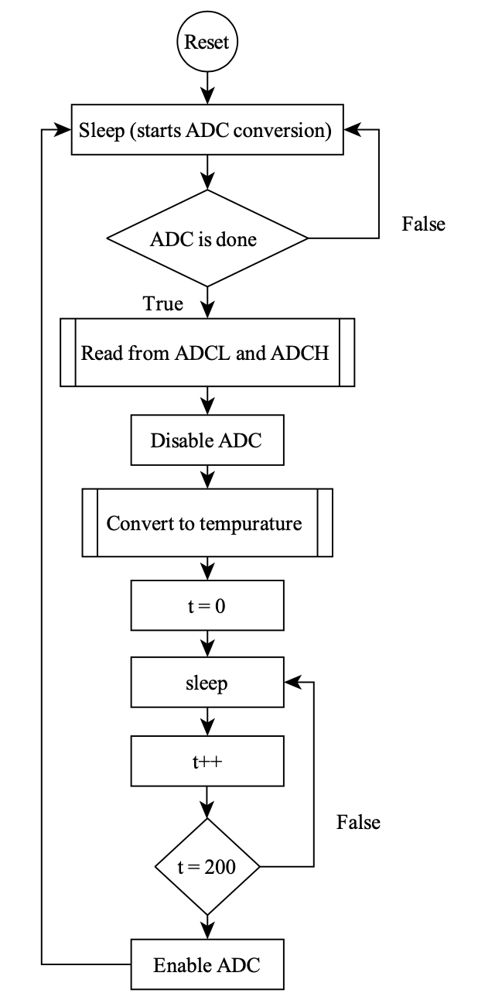
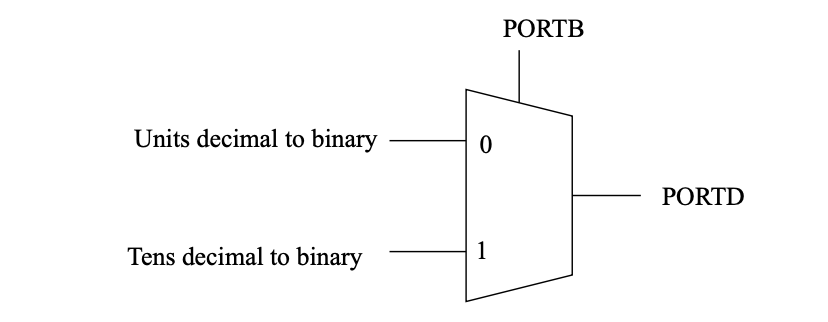
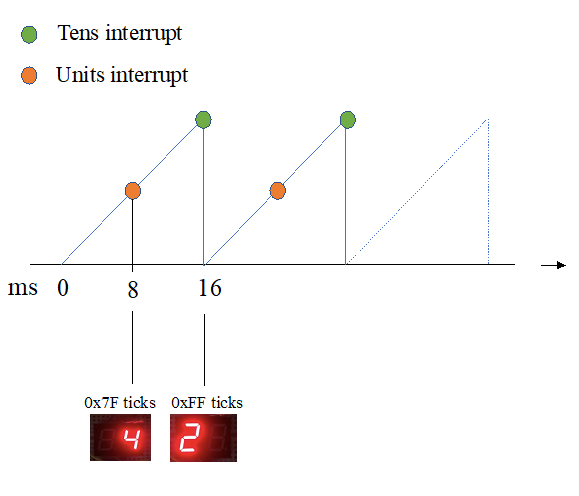

# Table of Contents

- [Ambient Temperature Measurement System](#ambient-temperature-measurement-system)
  - [Features](#features)
  - [Usage](#usage)
  - [Design](#design)
    - [System Overview](#system-overview)
    - [Inputs](#inputs)
    - [Analog to Digital Converter](#analog-to-digital-converter)
    - [The Conversion Algorithm](#the-conversion-algorithm)
    - [Output](#output)
    - [Power Saving](#power-saving)
    - [Program memory vs Data memory](#program-memory-vs-data-memory)
    - [Trade-offs](#trade-offs)
  - [Conclusion](#conclusion)
  - [References](#references)

# Ambient Temperature Measurement System

*School of Electrical and Information Engineering, University of the Witwatersrand, Johannesburg 2050, South Africa*

This project aims to engineer a system capable of measuring the temperature of the surrounding environment and displaying the result to the user. 

# Features

* Utilizes the MCP9700-series temperature sensor and the ATMega328p microcontroller (MCU)
* Displays temperature on two seven-segment displays
* Temperature range: 0°C to 74°C with ±1°C accuracy

This project imposes the constraint of coding the firmware exclusively in the AVR instruction set, while prohibiting the use of additional integrated circuits. Therefore, the project required an intricate understanding of the 328P's architecture.

# Usage 

Assuming the system is implemnted as described below, follow these instrcutions to run burn the code onto the 328P:

1. Open Atmel Studio and create a new project.
2. Choose the appropriate microcontroller model (e.g., ATmega328P) for your project.
3. Create a new source file in the project.
4. Copy the provided code into the new source file.
5. Build the project to compile the code.
6. Connect your microcontroller to the computer using a programmer (e.g., AVRISP, USBasp) and ensure it is recognized by Atmel Studio.
7. Configure the programming settings in Atmel Studio to match your hardware setup (e.g., programmer, microcontroller model, communication interface).
8. Program the microcontroller by selecting the appropriate programming option in Atmel Studio (e.g., "Device Programming" or "Start Without Debugging").
9. After successful programming, disconnect the programmer from the microcontroller.
10. Connect the necessary hardware components according to the circuit diagram in Figure 2.
11. Power up the circuit and observe the temperature readings displayed on the seven-segment displays.

# Design

### System Overview

*Figure 1: System circuitry implemented on a bread board*

*Figure 2: System electircal schematic with a 5V supply*

### Inputs

The MCP9700 is a linear thermistor integrated circuit [1]. It has 3 pins, as shown in Figure 2. The thermistor's resistance changes with temperature, which, in turn, affects the voltage at $V_{out}$. By monitoring this voltage change with the microcontroller, the temperature can be recorded. The relationship between the voltage and temperature is given by Equation (1) [1].

$$ V_{out} = T_{c} \times T_{A} + V_{0^\circ C} \ \ \ \ \ (1)$$

Where:
- $T_{c}$ is the temperature coefficient ($10mV/°C$)
- $T_{A}$ is the ambient temperature
- $V_{out}$ is the output voltage
- $V_{0^\circ C}$ is the output voltage at 0°C (50°C)

### Analog to Digital Converter

To translate the voltage change at $V_{out}$ into a digital signal that the microcontroller can process, the 328P's analog to digital converter (ADC) is employed. For this project, a 10-bit resolution was chosen to detect smaller changes in temperature. The ADC clock pre-scaler was set to 128, which provides a sufficient sample rate (50kHz to 200kHz) for accurate measurements. It is important to note that the ADC's precision is enhanced, not its accuracy, which depends on the chosen reference voltage [5]. In this case, the reference voltage was set to 5V.

### The Conversion Algorithm 

The main logic for the assembly code is based on the flowchart in Figure 4. Two interrupts were used: an ADC conversion complete, and a Timer interrupt. The benefit of using interrupts is that the interrupt handler will only be executed when needed, thereby allowing other activities to happen in the background. 

A feature of the ADC is that when entering the idle sleep mode, a conversion will start to reduce noise from other circuitry within the MCU [2]. Once the conversion is complete, the ADC complete interrupt will read the result from the ADC registers. Once the number is stored in a general-purpose register, a subroutine converts it to a temperature by making use of fixed-point arithmetic. The FMUL instruction allows for Q(n.m) multiplication. Equation (2) shows how FMUL is effectively multiplying the ADC value by 125 and shifting the result to the right 7 times. However, the result is shifted once more to be in the original 8-bit form. 50 is then subtracted from the result to account for the output voltage at 0° C.

$$
TA = \frac{{ADC \times \frac{{V_{ref}}}}{{2^{\text{{resolution}}} \times T_c}}}{{T_0°C}} = \frac{{ADC \times \frac{{5000 \, \text{{mV}}}}{{1024 \times 10 \, \text{{mV}}}} - 50}}
$$

The temperature is separated into tens and units to display it on the seven-segment displays. The FMUL is used again by multiplying the temperature value by 26 and doing a logical shift to the right to get the tens value. The result is then multiplied by 10 and subtracted from the original temperature to get the units, as seen in Equation (3).

\[
Tens = \frac{{TA \times 26}}{{12}}
\]

\[
Units = TA \times 10 - T
\]

Where \( T \) represents the temperature.

*Figure 4: Flow diagram showing the main logic for the code*

When the microcontroller enters idle sleep mode, a conversion is triggered to reduce noise.

### Output

The display of both unit and tens values would typically require a total of sixteen pins, with each segment needing seven pins plus one for ground. However, to minimize the pin count, the displays are multiplexed [3]. As shown in Figure 2, this multiplexing technique reduces the required pins to seven for the segments and two for selection. To control the display, an NPN transistor is utilized as a switch. When PB0 is high, the tens value is displayed, and when PB1 is high, the units value is displayed. Additionally, the transistor amplifies a smaller current from these pins through each segment to ground [4]. To ensure proper operation, 1410-ohm resistors are connected to the transistor bases. Each segment is connected to a 470-ohm resistor instead of using a high resistance connected to the common ground of each display. This arrangement ensures that each segment draws an equal amount of current, resulting in uniform brightness. The multiplexing logic can be seen in Figure 5.

To decode the units and tens values into their corresponding binary numbers, a lookup table is stored in program memory.

*Figure 5: Multiplexing Units and Tens values to PORTD on the MCU*

Timer interrupts are employed to instruct the microcontroller on which pins to set high and when to do so. This is achieved by pre-scaling the clock by a factor of 1024. With a clock speed of 16 MHz, the timer clock is reduced to approximately 16 kHz. An interrupt is triggered approximately every 8 milliseconds, corresponding to 255 ticks for Compare match A and 127 ticks for Compare match B. Figure 6 illustrates the timing diagram for both compare registers. The interrupt handler for compare registers A and B outputs the units and tens values, respectively, to PORTD.

*Figure 6: Timing diagram for multiplexing interrupts*

### Power Saving:

### Idle mode:
To minimize power consumption, the ADC is disabled when not in use [2]. Additionally, a second sleep loop is implemented to further conserve power while the ADC remains disabled.

### Multiplexing:
To optimize power usage during display switching, the frequency at which the displays alternate is set as low as possible. The human eye can perceive frequencies up to approximately 60Hz [7]. Thus, the displays are turned on and off at a frequency of 120Hz, which is the lowest achievable frequency for an 8-bit timer. This ensures that the human eye cannot detect the switching, resulting in power savings.

### Program memory vs Data memory:

The choice of storing the lookup table in program memory offers power-saving benefits. Program memory is non-volatile [2], meaning that the lookup table only needs to be burned into the microcontroller once. In contrast, if the lookup table were stored in data memory, it would require setup every time the device is powered up since data memory is volatile. By utilizing program memory, power consumption is reduced.

### Trade-offs

While designing the final solution, multiple approaches were considered. The pros and cons of each solution are summarized in the following table:

| Solution                    | Pros                                 | Cons                                               |
|-----------------------------|--------------------------------------|----------------------------------------------------|
| Using a timer to start an ADC | More control over conversion start   | Incompatible with sleep modes like idle mode and ADC noise cancelling mode  |
| 8-bit resolution             | Fewer cycles for ADC value reading   | Less precise temperature readings                   |
| Using 16 pins for displays   | Easier setup                         | Higher power consumption due to constant display operation    |

In the end, the trade-offs made were good ones as more power is saved and the temperature reading is more precise.

# Conclusion 

The system provides a suitable temperature measurement range for in-home use, covering 0°C to 74°C with an accuracy of ±1°C. This range is considered adequate considering the MCU's maximum withstand temperature of 85°C [2] and typical room temperatures falling between 20°C and 22°C [6].

During the design and implementation process, valuable knowledge was gained on utilizing existing engineered products, understanding MCU operation, and constructing breadboard circuits. Successful aspects of the design included display multiplexing and setting up the lookup table in program memory.

To enhance the design, negative temperature readings could be included using the FMULS instruction for signed arithmetic. Additionally, the addition of another display for the fractional component of the temperature could improve accuracy to one decimal place.

In conclusion, the solution successfully displays the temperature on two seven-segment displays, incorporating the MCP9700 temperature function, ADC resolution, and reference voltage of the ATMega328p. The displayed temperature range is 0°C to 74°C with an accuracy of ±1°C. However, further improvements are possible to withstand harsher environments and provide more accurate temperature readings.

# References 

1. Microchip Technology Inc., "MCP9700/MCP9700A Temperature Sensor," [Online]. Available: http://ww1.microchip.com/downloads/en/DeviceDoc/20001942F.pdf.

2. Microchip Technology Inc., "ATmega48A/PA/88A/PA/168A/PA/328/P Datasheet," [Online]. Available: http://ww1.microchip.com/downloads/en/DeviceDoc/ATmega48A-PA-88A-PA-168A-PA-328-P-DS-DS40002061A.pdf.

3. A. Subero, "Programming Pic Microcontrollers with Xc8," Apress, 2018.

4. P. Horowitz and W. Hill, "The art of electronics," Cambridge Univ. Press, 1989.

5. M. Oljaca and B. Baker, "How the voltage reference affects ADC performance, Part 2," Analog Applications, pp. 5-9, 2009.

6. H. Company, "The American Heritage Dictionary Entry: Room Temperature," [Online]. Available: https://web.archive.org/web/20150108000657/https://ahdictionary.com/word/search.html?q=room+temperature [Accessed 7 June 2020].

