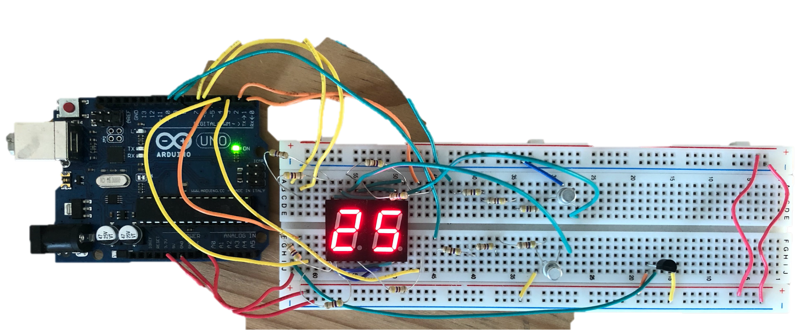

# Ambient Temperature Measurement System

*School of Electrical and Information Engineering, University of the Witwatersrand, Johannesburg 2050, South Africa*

This project aims to engineer a system capable of measuring the temperature of the surrounding environment and displaying the result to the user. 

# Features

* Utilizes the MCP9700-series temperature sensor and the ATMega328p microcontroller (MCU)
* Displays temperature on two seven-segment displays
* Temperature range: 0°C to 74°C with ±1°C accuracy

This project imposes the constraint of coding the firmware exclusively in the AVR instruction set, while prohibiting the use of additional integrated circuits. Therefore, the project required an intricate understanding of the 328P's architecture.

## Design

### System Overview

### Inputs

The MCP9700 is a linear thermistor integrated circuit [1]. It has 3 pins, as shown in Figure 2. The thermistor's resistance changes with temperature, which, in turn, affects the voltage at $V_out$. By monitoring this voltage change with the microcontroller, the temperature can be recorded. The relationship between the voltage and temperature is given by Equation (1) [1].

$$ V_{out} = T_{c} \times T_{A} + V_{0^\circ C} \ \ \ \ \ (1)$$

Where:
- $T_{c}$ is the temperature coefficient ($10mV/°C$)
- $T_{A}$ is the ambient temperature
- $V_{out}$ is the output voltage
- $V_{0^\circ C}$ is the output voltage at 0°C (50°C)

### Analog to Digital Converter

To translate the voltage change at $$V_out$$ into a digital signal that the microcontroller can process, an analog to digital converter (ADC) is employed. The ADC converts the continuous analog signal into a discrete digital number by approximating the voltage change [2]. For this project, a 10-bit resolution was chosen to detect smaller changes in temperature. The ADC clock pre-scaler was set to 128, which provides a sufficient sample rate (50kHz to 200kHz) for accurate measurements. It is important to note that the ADC's precision is enhanced, not its accuracy, which depends on the chosen reference voltage [5]. In this case, the reference voltage was set to 5V.

### The Conversion Algorithm 

The main logic of the assembly code is based on the flowchart shown in Figure 4. Two interrupts are used: ADC conversion complete and Timer interrupt. Utilizing interrupts ensures that the interrupt handler is executed only when necessary, allowing other activities to occur in the background.

When the microcontroller enters idle sleep mode, a conversion is triggered to reduce noise.
